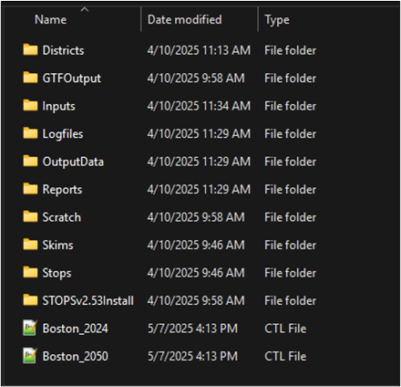

# Setup and First Run

This section provides instructions for the initial setup and execution of the Boston Regional STOPS Model.

---

## System Requirements

* **Storage**: At least **100 GB** of free disk space.
* **File Paths**: Extract model files to a high-level directory (e.g., `C:\BostonSTOPS`) with no blank spaces in the path. STOPS may crash if spaces are present in the directory path. The control file path should not exceed 80 characters.
* **Software**: A compatible GIS application (ArcGIS Desktop, ArcGIS Pro, or TransCAD) is required for full functionality.

---

## Model Setup

### 1. Launch STOPS and Configure Executables
The model package includes a folder named `STOPSv2.53Install`. Launch the program by running **`STOPSMenu.exe`**.

<html lang="en">
<body_mk_box>

The model's folder structure is shown below.

Model Folder Structure

</body_mk_box>
</html>

After launching, you must link the appropriate GIS and Python executables.

* **ArcGIS Desktop**: `C:\Program Files (x86)\ArcGIS\Desktop10.8\bin\ArcMap.exe`
* **ArcGIS Pro**: `C:\Program Files\ArcGIS\Pro\bin\ArcGISPro.exe`
* **TransCAD**: `C:\Program Files (x86)\TransCAD\tcw.exe`

### 2. Select a Control File
Once configured, select a control file in **Step 1** of the STOPS interface.
* **`Boston_2024.ctl`**: For the 2024 base year scenario.
* **`Boston_2050.ctl`**: For the 2050 forecast year scenario.

STOPS will automatically generate the necessary subfolders required for model execution.

---

## Executing the First Model Run

### Step A: Data Preparation
Run these steps from the STOPS menu individually. The status will update to `FILES FOUND!` upon successful completion.
* **Step 7**: Create/Update District File
* **Step 9**: Assemble ACS/CTPP Data
* **Step 10**: Prepare MPO Data

### Step B: Run Batch Steps
After preparing the data, execute the full model by selecting **Step 11**. A complete run takes approximately **five hours**. All status indicators will update to `COMPLETE!` when finished.

### Step C: Review Results
Results can be viewed by selecting **Step 12** on the menu, which opens the main report file. You can also navigate to the `Reports` folder in your model directory to view all output files.